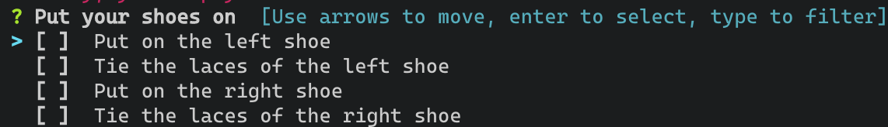

# reapy

Make complex tasks repeatable by breaking them down into small automated steps.

## Concept

The idea is to break down complex tasks into their individual steps.

A typical installation of software might consist out of the following steps:

1. Download the software
2. Unzip the archive the software is distributed int
3. Copy the unzipped files to the target folder
4. Generate/Adjust the configuration
5. Install the software (i.e. as a windows service)

Such a process is defined inside of a YAML file. It consits out of the following pieces.

To break the process down we distinguish the following building blocks:

* Plan  
The overaching goal we want to achieve. (i.e. installing a piece of software). Each plan consists out of one ore more tasks.
* Task  
Each plan consists out of multiple tasks. A task could be the update of a database and checking that the update was successful. Each task therefore consists out of one or more steps.
* Step  
A small piece of work contributing to the fulfillment of a task or a check to ensure that a previous step was executed successfull. (i.e. unzipping a file or copying a folder from one place to another) (i.e. having the user manually confirm something or checking that a log file contains no errors)

### MVP

The following gives an overview of the bare minimum that needs to work in order for this to be a usable tool.

* [x] Read plan definition from YAML file
* [x] Protocol the execution of a plan in a file
* [x] Validate the plan definition file
* [x] Allow for the definition of variables that can be used in the YAML file

#### Steps

* [x] Unzip file
* [x] Copy file/folder
* [x] Create folder
* [x] Delete file/folder
* [ ] Replace/Add strings to file  
This should work interactively (ask the user what to fill in)
* [x] Stop service
* [x] Start service
* [ ] Ask user a question (Yes/No)
* [ ] Check that a file/folder is present
* [ ] Define which steps to repeat if a check was unsuccessfull
  * [ ] Validate that repeating the defined steps results in the same check that was unsuccessfull
* [ ] Read a file and check it for the occurens of string (i.e. errors in a log file)
* [x] Wait for something (i.e. wait for the occurens of a specific string in a log file / wait for a service to start / when deleting the a `.war` file in the *webapps* folder of Tomcat, wait that the deployed distribution was delted)
* [x] Download file
* [x] execute generic command

### Additional Features

Thinks outside of the scope of the MVP that would add value.

* [x] Allow for hot-reloading of the plan definition
* [ ] Execute SQL against database to check the result (Check)

## Libraries

* [go-prompt](https://github.com/c-bata/go-prompt)  
Make the shell interactive (Works with Powershell/Command Prompt)
* [survey](https://github.com/AlecAivazis/survey)  
Allow for user input (Works with Powershell/Command Prompt)
* [tview](https://github.com/rivo/tview)  
Alternative to *survey* (Works with Powershell/Command Prompt)
* [termui](https://github.com/gizak/termui)  
Charts, lists and other widgets (Works with Powershell/Command Prompt but doesn't look to good)
* [color](github.com/gookit/color)  
Allow printing to the console in color

## Build

The tool [goversioninfo](https://github.com/josephspurrier/goversioninfo) has to be installed in order to be able to build this project.

It should be enough to execute `go get github.com/josephspurrier/goversioninfo/cmd/goversioninfo` to install it.

To build the project execute:

```shell
go generate
go build
```

## Documentation

### Variables

Variables can be defined at the top of a config file and used in the preferences of the steps.

The following example defines a variables called `install_path` and uses it in a step  to create the folders for this path.

```yaml
Variables:
  install_path : "C:\\Users\\christian\\git\\github.com\\ChristianHuff-DEV\\reapy\\install"
Plans:
  - Name: Test
    Tasks:
    - Name: Test
      Steps:
      - Kind: CreateFolder
        Preferences:
          Path: "${install_path}"
```

### Default Variables

The following is a list of variables that are available by default an whose values are determined on the start of the app.

These variables can be overwritten by defining them in the `Variables` section of the config file.

* `workdir`  
The folder the app is started in.
* `date`  
The current date in the format "2006-01-02"

### Step types

The following gives an overview of all step types and how to use them.

#### Checklist

This step is used to present the user with a checklist. It can be used to give step by step instructions. All items of the checklist have to be ticked in order to continue with the execution of the plan.



Parameter:

* `Message` (string / optional)  
Optional message that is displayed as the header of the checklist.
* `Items` (string array / required)  
The individual items of the checklist. They will be displayed in the same order they are defined in.

Example:

```yaml
- Kind: Checklist
  Description: Show step by step instructions to put your shoes on
  Preferences:
    Message: Put your shoes on
    Items:
    - Put on the left shoe
    - Tie the laces of the left shoe
    - Put on the right shoe
    - Tie the laces of the right shoe
```

#### Command

This step type is used to run generic commands.

Parameter:

* `Command` (string / required)  
The command to be executed.
* `Path` (string / optional)  
The path the command is executed in.
* `Args` (string array / optional)  
Used to pass additional arguments. Each argument needs to be it's own item in this array.
* `Silent` (bool / optional / default: *false*)  
Whether or not the output of the command is printed to the console. The output will always be written to the log file.

Example:

Execute the `service.bat` file used to install the Tomcat service.

```yaml
- Kind: Command
  Description: Execute the command installing Tomcat as a Windows service
  Preferences:
    Command: "cmd.exe"
    Path: "C:\\Users\\christian\\apache-tomcat\\bin"
    Args:
      - "/C"
      - "service.bat install"
```

#### Copy

This step type is used to copy a file/folder. Depending on the *source* path the step determines if a file or folder has to be copied.

If a file is copied the *destination* path has to include the file name. If the file already exists it will be overwritten.

If a folder is to be copied and the target folder already exists all files and folders of the *source* path are merged into the *destination* path. Existing files will be overwritten.

If the target folder (or any of it's parents) doesn't exist it will be created.

Preferences:

* `Source` (string / required)  
From where to copy the file/folder
* `Destination` (string / required)  
Where to copy the file/folder to

Example:

```yaml
- Kind: Copy
  Description: Copy help.txt from A to B
  Preferences:
    Source: "C:\\Users\\christian\\from"
    Destination: "C:\\Users\\christian\\to"
```

#### CreateFolder

This step is used to create a folder. If the parent folder(s) is/are missing the command will fail.

Preferences:

* `Path` (string / required)  
The path of the folder to be created.

Example:

```yaml
- Kind: CreateFolder
  Description: Create a temp dir
  Preferences:
    Path: "C:\\Users\\christian\\temp"
```

#### Delete

This step is used to delete a file/folder.

Preferences:

* `Path` (string / required)  
The path of the file/folder to delete.

```yaml
- Kind: Delete
  Description: Delete the temp folder
  Preferences:
    Path: "C:\\Users\\christian\\temp"
```

#### Download

This step is used to download a file through *http*.

Preferences:

* `URL` (string / required)  
The URL from where to download the file.
* `Path` (string / required)  
The path to the **folder** the file is downloaded to. (**Must** exist.)

Example:

```yaml
- Kind: Download
  Description: Download Tomcat
  Preferences:
    URL: "https://www-eu.apache.org/dist/tomcat/tomcat-9/v9.0.30/bin/apache-tomcat-9.0.30-windows-x64.zip"
    Path: "C:\\Users\\christian\\temp"
```

#### Service

This step type is used to start/stop a service.

**Currently only supported under Windows.**

Preferences:

* `Name` (string / required)  
Name of the service. Has to be the *service name* not the *display name*.
* `Action` (string / required / Possible values: *start/stop*)  
Whether the service should be started or stopped.

Example:

```yaml
- Kind: Service
  Description: "Start the Tomcat service"
  Preferences:
    Name: "Tomcat8"
    Action: start
```

#### Unzip

This step type is used to extract a `zip` archive.

Preferences:

* `Source` (string / required)  
Path to the `zip` file to be extraced.
* `Destination` (string / required)  
Path to the folder the content of the archive is placed in. (A folder with the same name as the *zip* file is created inside of this path.)

Example:

```yaml
- Kind: Unzip
  Description: Unzip Tomcat release
  Preferences:
    Source: "C:\\Users\\christian\\temp\\apache-tomcat-9.0.30-windows-x64.zip"
    Destination: "C:\\Users\\christian\\temp"
```

#### Watch

This step is used to watch a file searching for a defined string. (Think of `tail -f | grep`)

If the message is already present in the file when this step starts it will finish immediately. Otherwise the file will be watched until the message shows up in the file or the timeout is reached.

Preferences:

* `Path` (string / required)  
The path  to the file to be watched.
* `Message` (string / required)  
The message the step is looking for.
* `Timeout` (int / optional / default: *300*)  
Number of seconds the file is watched, before the step is aborted.

Example:

```yaml
- Kind: Watch
  Description: "Watch the Tomcat log to check if is started"
  Preferences:
    Path: "C:\\Users\\christian\\temp\\apache-tomcat\\logs\\catalina.2019-12-20.log"
    Message: "Tomcat started"
```
